# SharpMetal: Bare-Metal C# x86-64 Microkernel

[](https://github.com/sadik00789/SharpMetal/actions)
[](https://github.com/sadik00789/SharpMetal/releases/latest)
[](https://en.wikipedia.org/wiki/X86-64)
[]()
[](https://learn.microsoft.com/en-us/dotnet/core/deploying/native-aot/)
[](https://uefi.org/)
[]()
[]()
[]()
[]()
[]()

A high-performance, capability-based bare-metal operating system microkernel and multi-server userland written entirely in **C# using Native AOT compilation**, targeting modern 64-bit x86-64 hardware without any dependencies on the standard runtime (CoreCLR), glibc, or external bootloaders.

The system boots directly from UEFI firmware into higher-half virtual memory, enforces hardware privilege separation (Ring 0 supervisor vs. Ring 3 userland), routes communications through a capability-secured synchronous and asynchronous IPC engine, and provides hardware-accelerated graphics (AVX2), high-throughput storage (NVMe DMA), a dedicated FAT32 filesystem server with a Virtual File System (`System.IO.File`), modern VirtIO network acceleration, fault-tolerant supervisor supervision, and an interactive graphical terminal shell.

<p align="center">
  
</p>

---

## Architecture Overview

```mermaid
graph TD
    subgraph Ring3_Userland ["Ring 3: Isolated Userland Processes (CPL = 3)"]
        Shell["apps/shell<br/><i>Micro-GC Runtime | PSF2 Text Grid | History</i>"]
        StorageDriver["storage.nvme<br/><i>ZeroAlloc Runtime | SPSC DMA Queues</i>"]
        Fat32Server["fs.fat32<br/><i>ZeroAlloc Runtime | BPB & Cluster Chains</i>"]
        NetDriver["net.virtio<br/><i>ZeroAlloc Runtime | Modern PCIe Capabilities</i>"]
        InputDriver["input.hid<br/><i>ZeroAlloc Runtime | PS/2 ANSI Translation</i>"]
        DisplayServer["display_server<br/><i>AVX2 Vector Blitter | Alpha Blending</i>"]
        PciServer["pci_server<br/><i>PCIe ECAM Discovery | FLR | MSI/MSI-X</i>"]
        Supervisor["supervisor<br/><i>Watchdog | Fault Reincarnation</i>"]
        Roottask["roottask<br/><i>Bootstrap Initrd | CSpace Delegator</i>"]
    end

    subgraph IPC_Layer ["Roslyn Source-Generated Zero-Alloc RPC"]
        ClientProxies["Devirtualized Client Proxies"] <-->|Hardware Syscall FastPath| ServerDispatchers["Type-Safe Server Dispatchers"]
    end

    subgraph Ring0_Kernel ["Ring 0: Higher-Half C# Microkernel (CPL = 0)"]
        SyscallDispatcher["Hardware SYSCALL/SYSRET Engine"]
        CSpace["seL4-Style Capability Space (CNode / CSpace / CDT)"]
        Scheduler["Preemptive MLFQ Scheduler & Timeslice Donation"]
        Paging["4-Level Paging (PML4) & HHDM (0xFFFF_8000_0000_0000)"]
        MemoryAlloc["Slab Allocator (Kmem) & PMM Bitmap & DMA Arena"]
        Arch["GDT, IDT (256 Gates), TSS (RSP0 Stack Isolation), LAPIC, PAT"]
    end

    subgraph Hardware ["x86-64 Bare-Metal Hardware & Peripherals"]
        CPU["x86-64 CPU (AVX2, FS/GS, SYSCALL)"]
        GOP["UEFI Graphics Output Protocol (GOP FB)"]
        NVMeHW["PCIe NVMe Block Device (Direct DMA / MSI Vector 0x30)"]
        NetHW["VirtIO-Net PCIe Controller (MSI Vector 0x31)"]
        KBHW["PS/2 Keyboard Controller (Port 0x60/0x64)"]
        PCIeECAM["PCIe ECAM Memory-Mapped Config Space"]
    end

    Shell -->|RegisterSurface / CommitSurface| DisplayServer
    Shell -->|ReadAllText / ReadAllBytes| Fat32Server
    Shell -->|SendPacket / ReceivePacket| NetDriver
    Fat32Server -->|ReadBlock / WriteBlock| StorageDriver
    Shell -->|Enumerate Topology| PciServer
    Supervisor -->|FLR Reset / Reincarnate| PciServer
    Supervisor -->|Health Check| DisplayServer
    Roottask -->|Spawn / Synthesize CSpace| Ring3_Userland

    Ring3_Userland <-->|FastPath SYSCALL| SyscallDispatcher
    SyscallDispatcher --> CSpace
    SyscallDispatcher --> Scheduler
    SyscallDispatcher --> Paging
    SyscallDispatcher --> MemoryAlloc

    Ring0_Kernel --> CPU
    DisplayServer --> GOP
    StorageDriver --> NVMeHW
    NetDriver --> NetHW
    InputDriver --> KBHW
    PciServer --> PCIeECAM
```



---

## The 12 Architectural Layers

| Layer | Component | Description |
|:---:|---|---|
| **1** | **Firmware Boot & Memory Map** | Direct UEFI 2.x application boot (`BOOTX64.EFI`) via `EfiMain.cs`. Resolves GOP framebuffer, parses ACPI RSDP, locates `INITRD.IMG`, extracts memory descriptors, and executes `ExitBootServices` with zero post-exit allocations. |
| **2** | **Higher-Half Handover & Paging** | Creates identity and higher-half direct map (HHDM) 4-level page tables at `0xFFFF_8000_0000_0000`. Programs IA32_PAT for Write-Combining (WC) on GOP framebuffer and jumps to higher-half `KernelMainHigh`. `DestroyAddressSpace` iteratively reclaims the user half (PML4 0–255; kernel half 256–511 preserved), handling 1GB/2MB huge pages (`PAGE_SIZE_BIT`) and guarding every free with `PageFrameAllocator.IsRam` so GOP/PCI MMIO is never returned to the PMM; wired into `ReapZombies` and supervisor reincarnation. |
| **3** | **Hardware Descriptors & Slab Heap** | Installs 64-bit Global Descriptor Table (GDT), 256-gate Interrupt Descriptor Table (IDT), per-core Task State Segment (TSS) with isolated 16 KiB RSP0 stacks, masks 8259 PIC, parses ACPI MADT for multi-core topology, calibrates the Local APIC timer (divide-by-16) against the 8254 PIT (channel 0, divisor 11932 ≈ 10ms; `ticksPerMs = elapsed/10`, periodic `INIT = ticksPerMs × QuantumMs`, vector 32), and initializes multi-pool slab allocator. |
| **4** | **Threading & Preemptive MLFQ** | Implements Dynamic SMP preemptive Multi-Level Feedback Queue scheduler (supporting up to 16 cores dynamically enumerated via ACPI MADT) with 4 priority levels, AP INIT-SIPI-SIPI bootstrap, broadcast IPI TLB shootdown engine (`0xFD`, IRQ-safe `SpinLockWithIrqSave`), round-robin timeslices, hardware context switching in NASM assembly, and MSR configuration (`STAR`, `LSTAR`, `FMASK`, `IA32_GS_BASE`) for `SYSCALL`/`SYSRET`. `SyscallEntry.asm` hardens the FastPath return: user `RSP` is swapped to the thread-local kernel stack (`[gs:16]`), 16-byte aligned (`and rsp, -16`), user `RIP` (`RCX`) and `RFLAGS` (`R11`) preserved on the kernel stack, `RDX/R10/R8/R9` preserved, payload returns in `RAX`, and `RCX`/`R11` are restored immediately before `sysretq`. `IA32_STAR[63:48]` is configured as `0x0010` so hardware `sysretq` calculates `User CS = 0x20 | 3` and `User SS = 0x18 | 3`. |
| **5** | **Capability Space (CSpace) & CDT** | seL4-inspired authorization model. Resources (threads, endpoints, notifications, page frames, CNodes) are referenced via guarded capability pointers (`cptr`) with cryptographic badges and access rights (`Read`, `Write`, `Call`, `Grant`). Features a zero-alloc Capability Derivation Tree (CDT) enforcing recursive capability revocation and synchronous virtual memory unmapping/TLB invalidation. |
| **6** | **Unified IPC Engine** | Dual-mode IPC supporting zero-copy synchronous rendezvous with timeslice donation (`sys_call`/`sys_reply`), 64-bit atomic asynchronous notifications (`sys_notify`), and unified dual-wait reactors (`sys_recv_any`). |
| **7** | **Userland Bootstrap & Root Task** | `roottask` is loaded from `INITRD.IMG`. Microkernel synthesizes an isolated 4-level page directory (PML4) with user bits (`Paging.User`), populates the root CNode, delegates capabilities across servers, and drops to Ring 3 (`CPL = 3`) via `iretq` using strict System V AMD64 ABI compliant `DropToUser` (`RDI=RIP`, `RSI=RSP`, `RDX=CR3`), static Win64 bridge `EnterUserMode`, 5-QWORD `iretq` frame (`User SS: 0x1B`, `User RSP`, `RFLAGS: 0x3202`, `User CS: 0x23`, `User RIP`), and full GPR scrubbing. |
| **8** | **Dual Runtimes & Roslyn RPC** | **`Userland.Runtime.ZeroAlloc`**: Freestanding, allocation-free runtime backed by `NativeArena` with dynamic chunk-linked expansion (`ArenaChunk`) via high DMA aperture `0x0000_7000_0000_0000UL` for high-throughput driver workloads.<br/>**`Userland.Runtime.Gc`**: Generational mark-sweep micro-GC for user applications.<br/>**`Microkernel.RpcGenerator`**: Roslyn Source Generator emitting devirtualized zero-alloc RPC proxies. |
| **9** | **PCIe Discovery, NVMe & VirtIO-Net** | `pci_server` maps ECAM space (`0xE0000000`) and programs PCI MSI/MSI-X vectors (NVMe vector `0x30`, VirtIO-Net vector `0x31`). `storage.nvme` initializes Admin Queue Attributes (`AQA`), Submission Queue Base (`ASQ`), and Completion Queue Base (`ACQ`) with 64-entry contiguous rings prior to controller enablement (`CC.EN = 1`), executes verified canary block write/read at LBA 65535, and dispatches interrupt notifications. `net.virtio` drives modern VirtIO-Net via assigned MSI vectors with 16-bit virtqueue wraparound safety (`avail->idx`/`used->idx` as `ushort`, `slot = idx & (RingSize-1)`, wraparound-safe `used - lastUsed` delta) and a descriptor-visibility barrier before index publication. |
| **10** | **FAT32 Filesystem Server & VFS** | `fs.fat32` mounts root block storage, parses BPB/FAT32 structures, and provides cluster-chain lookups. `Microkernel.Vfs` exposes clean `System.IO.File` APIs (`ReadAllText`, `ReadAllBytes`) using shared DMA pages. `Userland.PieLoader.LoadAndRelocateFromVfs` loads freestanding PIE binaries straight from FAT32 (PE section copy + `IMAGE_REL_BASED_DIR64` relocation); Ring-0 `SysSpawn (0x0B)` synthesizes the isolated address space, user/kernel stacks, CNode caps, and Ring 3 entry state. |
| **11** | **Fault Recovery & Supervisor** | `supervisor` acts as a watchdog process. Intercepts crashed or faulty driver states, performs PCIe Function-Level Resets (FLR), reincarnates child server execution, and reconstructs IPC capability bindings. |
| **12** | **Compositor & Graphic Shell** | `display_server` composites surfaces directly using AVX2 SIMD vector instructions (`vmovdqu`) with 8-bit alpha blending and dirty region clipping. `apps/shell` provides command history ring buffering, PSF2 font rendering, and integration commands. |

---

## Repository Structure

```
baremetal-csharp-microkernel/
├── build/
│   ├── config/                     # MSBuild compiler configuration props
│   │   ├── Kernel.props            # Kernel freestanding build properties
│   │   └── UserlandApp.props       # Userland service compilation props
│   └── scripts/                    # Build, disk image, and testing scripts
│       ├── Make-DiskImage.sh       # Native AOT pipeline, packaging, and GPT/FAT32 staging
│       ├── Make-UsbBootable.sh     # Safe flashing script for bare-metal USB drives
│       ├── Pack-Initrd.py          # Serializes system server binaries into initial ramdisk
│       ├── Run-Qemu.sh             # Launch QEMU with OVMF firmware, NVMe, and serial stdio
│       └── Test-Harness.py         # Automated streaming verification suite with milestone regex checks
├── src/
│   ├── apps/
│   │   └── shell/                  # Layer 12: Interactive graphic terminal shell (Micro-GC)
│   ├── common/
│   │   ├── Microkernel.Abstractions/ # Syscall numbers, RPC contracts, capability definitions
│   │   ├── Microkernel.Collections/  # Intrusive linked lists, bitmaps, and ring buffers
│   │   ├── Microkernel.Vfs/        # Layer 10: Virtual File System & System.IO.File abstraction
│   │   └── MiniCoreLib/            # Freestanding BCL implementation (no external stdlib)
│   ├── compiler-plugins/
│   │   └── Microkernel.RpcGenerator/ # Roslyn Source Generator for type-safe IPC dispatchers
│   ├── kernel/                     # Ring 0 Higher-Half Microkernel Core
│   │   ├── Arch/x86_64/            # CPU structures, GDT/IDT/TSS, PAT, LAPIC, assembly thunks
│   │   ├── Boot/                   # UEFI entry point (EfiMain), memory parser, ACPI discovery
│   │   ├── Capabilities/           # CNode, CSpace, CapabilityDerivationTree authorization engine
│   │   ├── Diagnostics/            # 16550 UART early serial logger
│   │   ├── Ipc/                    # Synchronous rendezvous, FastPath IPC, SyscallDispatcher
│   │   ├── Memory/                 # PMM bitmap, 4-level paging, HHDM, DMA arena, Slab allocator
│   │   └── Scheduling/             # Preemptive MLFQ scheduler, TCB, context switching
│   ├── libs/
│   │   ├── Microkernel.Drawing/    # ARGB32 surface blitter, PSF2 font rasterization, alpha blend
│   │   └── Microkernel.Sdk/        # Userland IPC channels and namespace resolution
│   ├── runtime/
│   │   ├── Userland.PieLoader/     # Relocatable position-independent ELF loader
│   │   ├── Userland.Runtime.Gc/    # Layer 8: Managed heap, mark-sweep micro-garbage collector
│   │   └── Userland.Runtime.ZeroAlloc/ # Layer 8: Allocation-free driver runtime with dynamic NativeArena
│   └── servers/                    # Ring 3 Isolated System Servers
│       ├── display_server/         # Layer 12: AVX2 hardware framebuffer compositor & dirty clipper
│       ├── drivers/
│       │   ├── input.hid/          # Layer 10: PS/2 keyboard driver & ANSI escape sequence translator
│       │   ├── net.virtio/         # Layer 9: VirtIO-Net modern PCIe controller driver
│       │   └── storage.nvme/       # Layer 9: High-throughput NVMe DMA storage driver
│       ├── fs.fat32/               # Layer 10: Ring 3 FAT32 filesystem server
│       ├── pci_server/             # Layer 9: PCIe ECAM topology discovery, MSI-X routing, and FLR control
│       ├── roottask/               # Layer 7: Initial bootstrap task and CSpace delegator
│       └── supervisor/             # Layer 11: Process watchdog and fault recovery supervisor
├── .gitignore                      # Git exclusion rules for native & managed artifacts
├── Directory.Build.props           # Workspace-wide Roslyn and compilation flags
└── README.md                       # Comprehensive architectural documentation
```

---

## Low-Level Technical Highlights

### 1. Freestanding Native AOT (`MiniCoreLib`)
Standard .NET relies on CoreCLR, which assumes an underlying operating system (POSIX libc or Win32 API). This microkernel builds against `MiniCoreLib`, a custom, zero-dependency BCL defining:
- Core primitive types (`object`, `string`, `Array`, `ValueType`, `Enum`, `IntPtr`, `UIntPtr`).
- Hardware attributes (`[UnmanagedCallersOnly]`, `[StructLayout]`, `[MethodImpl]`).
- Strict memory-safety abstractions (`Span<T>`, pointer arithmetic, and intrinsic bit manipulation).
- Zero static `.cctor` initializers or runtime metadata tables in freestanding binary sections.

### 2. Roslyn Compile-Time RPC Generation
Inter-process communication between isolated Ring 3 servers uses the Roslyn source generator `Microkernel.RpcGenerator`. Interfaces decorated with `[RpcContract]` generate:
- Devirtualized client proxy structs mapping method calls into hardware registers (`d0`..`d3`) and issuing `sys_call`.
- Server dispatchers matching RPC method identifiers in tight switch statements with zero heap allocations.

```csharp
[RpcContract]
public interface IBlockStorageService
{
    [RpcMethod(1)]
    ulong ReadBlock(ulong lba, ulong shmCptr);

    [RpcMethod(2)]
    ulong WriteBlock(ulong lba, ulong shmCptr);
}
```

### 3. SPSC Zero-Copy NVMe DMA Transfers
The NVMe driver operates entirely in userland:
- Allocates strictly 4096-byte aligned physical frames from the microkernel's contiguous DMA arena for Admin Submission/Completion Queues (ASQ/ACQ) and I/O Queues (IOSQ/IOCQ).
- Configures 64-bit BAR0 and enables Bus Mastering (Bit 2) and Memory Space (Bit 1) in the PCI Command Register.
- Safe controller shutdown and initialization sequence obeying the NVM Express 1.4 specification (`CC = 0x00460001`: 4 KiB page size, 64-byte SQEs, 16-byte CQEs).

### 4. AVX2 SIMD Framebuffer Compositing
The display server composites graphical windows and text surfaces onto the UEFI GOP framebuffer using 256-bit AVX2 SIMD instructions. Unaligned sub-rectangles are processed using `vmovdqu` to prevent `#GP` alignment exceptions:
```nasm
Avx2Blit:
.blit32:
    cmp rcx, 32
    jb .blit1
    vmovdqu ymm0, [rsi]
    vmovdqu [rdi], ymm0
    add rsi, 32
    add rdi, 32
    sub rcx, 32
    jmp .blit32
```

### 5. Interrupt-Driven PCIe MSI/MSI-X Routing
Rather than burning CPU cycles in driver polling loops, `pci_server` parses PCI capability linked lists (`CapID 0x05` and `0x11`) and programs Message-Signaled Interrupts directly:
- NVMe completion queues route to vector `0x30`, VirtIO-Net TX/RX rings route to vector `0x31`.
- Hardware interrupts are dispatched via `InterruptDispatcher` directly into the target driver's bound asynchronous `Notification` capability via `Notification.Signal(badge)` using collision-free vector lookup tables.

### 6. Synchronous Page Unmapping on Capability Revocation
To eliminate dangling frame pointers and stale address translations:
- Memory capabilities register parent-child lineages inside a zero-alloc `CapabilityDerivationTree` (CDT).
- Revoking or deleting a frame capability synchronously traverses the owning process's 4-level paging hierarchy (PML4 -> PDPT -> PD -> PT), zeros the PTE, strips `PTE_GLOBAL`, and issues `Cpu.Invlpg` shootdowns before reclaiming the capability slot.

### 7. Dynamic SMP Multiprocessing & Hardware TSS Isolation
- **Dynamic Core Discovery & AP Trampoline**: Automatically detects core topology and Local APIC IDs via ACPI MADT tables (supporting up to 16 cores dynamically). Wakes Application Processors (APs) via standard INIT-SIPI-SIPI sequences targeting a 16-bit real-mode trampoline staged at physical `0x0000_8000`, switching through protected mode into 64-bit long mode.
- **Strict Higher-Half Descriptors**: To guarantee faultless Ring 3 operation where PML4[0] is unmapped, all GDT, IDT, and TSS base structures and `PerCpuData` pointers (`IA32_GS_BASE`) reside strictly in canonical higher-half virtual memory (`Hhdm.Base`).
- **Independent Task State Segments**: Each core maintains its own isolated TSS and 16 KiB interrupt stack. `TaskStateSegment.SetRsp0` exclusively updates the calling core's `TSS.Rsp0` and `KernelRsp`, preventing cross-core stack corruption during thread context switches.
- **Atomic Serialization**: High-throughput `SysLog` calls use whole-message locking via `SpinLockWithIrqSave`, completely preventing concurrent inter-core character interleaving on early serial outputs.
- **Broadcast IPI TLB Shootdown**: Synchronizes page table modifications across all active cores using vector `0xFD` inter-processor interrupts and atomic acknowledgment bitmask synchronization.

### 8. System V AMD64 ABI Ring 3 Privilege Transition
To guarantee rock-solid privilege transitions into userland:
- **System V AMD64 ABI Compliance**: `DropToUser` strictly follows System V calling conventions (`RDI = RIP`, `RSI = RSP`, `RDX = CR3`). A static bridge `EnterUserMode` (`mov rdi, rcx; mov rsi, rdx; mov rdx, r8; jmp DropToUser`) supports Win64 callers without fragile runtime sniffing.
- **Atomic 16-Byte Stack Alignment**: In `SyscallEntry.asm`, user `RSP` is swapped to thread-local kernel stack `[gs:16]` and aligned via `and rsp, -16`. This prevents 16-byte alignment traps (`#GP(0)`) on vector instructions (`movaps`) within Native AOT compiled kernel C# routines.
- **Hardware Selector Arithmetic**: Explicit descriptors `UserDsSelector = 0x1B` (offset `0x18 | 3`) and `UserCsSelector = 0x23` (offset `0x20 | 3`) align with `IA32_STAR[63:48] = 0x0010`, ensuring `sysretq` computes target selectors `STAR[63:48] + 16` (`0x20 | 3 = 0x23`) and `STAR[63:48] + 8` (`0x18 | 3 = 0x1B`).
- **GPR Scrubbing**: All general-purpose registers (`RAX`–`R15`) are zeroed prior to `iretq` execution to prevent kernel address and data leaks into Ring 3.

---

## Getting Started

### Quick Test Drive (Pre-built Release)
To run the microkernel immediately without compiling the source code:

```bash
# 1. Download pre-built disk image
curl -LO https://github.com/sadik00789/SharpMetal/releases/download/v1.1.0/disk.img

# 2. Create backing image for NVMe benchmark storage
qemu-img create -f raw nvme.img 64M

# 3. Launch QEMU (Universal / Emulated AVX2)
qemu-system-x86_64 -machine q35 -cpu max -m 1G \
  -drive if=pflash,format=raw,readonly=on,file=/usr/share/OVMF/OVMF_CODE.fd \
  -drive file=disk.img,format=raw \
  -drive file=nvme.img,format=raw,if=none,id=nvm \
  -device nvme,serial=nvme01,drive=nvm \
  -netdev user,id=net0 -device virtio-net-pci,netdev=net0
```

---

### Prerequisites
To build the microkernel from source, ensure your host build system (Linux x86-64) has the following packages installed:

```bash
# Ubuntu / Debian
sudo apt-get update
sudo apt-get install -y dotnet-sdk-10.0 nasm lld qemu-system-x86 ovmf parted mtools xorriso python3

# Arch Linux
sudo pacman -S dotnet-sdk nasm lld qemu-system-x86 edk2-ovmf parted mtools xorriso python
```

### 1. Build the Complete Microkernel & Disk Image
Run the unified build pipeline script:
```bash
bash build/scripts/Make-DiskImage.sh
```
This script automatically:
1. Compiles `MiniCoreLib`, abstractions, and Roslyn generators.
2. Builds IL binaries for the microkernel and all 7 userland servers.
3. Invokes RyuJIT / `ilc` (Native AOT) to emit freestanding COFF object files.
4. Assembles assembly thunks (`nasm -f win64`).
5. Links `BOOTX64.EFI` and server binaries using `lld-link`.
6. Packages all servers into `INITRD.IMG`.
7. Creates a 64 MiB raw NVMe storage image (`build/nvme.img`).
8. Creates a 64 MiB GPT-partitioned disk image (`build/disk.img`) with FAT32 EFI System Partition.

### 2. Run in QEMU
Launch the microkernel under QEMU with UEFI firmware, NVMe emulation, and serial console redirection:
```bash
bash build/scripts/Run-Qemu.sh
```

> **Tip (Display Mode):** `Run-Qemu.sh` defaults to `-display none` for clean headless execution and CI logging. To view the live AVX2 graphical desktop window directly on your screen, run:
> ```bash
> bash build/scripts/Run-Qemu.sh -display default
> # or: -display gtk / -display sdl
> ```

### 3. Run Automated End-to-End Test Suite
Execute the automated regression harness:
```bash
python3 build/scripts/Test-Harness.py
# Or rebuild the disk image and test in one step:
python3 build/scripts/Test-Harness.py --build
```
The test harness builds the system, boots QEMU headlessly, streams serial logs, sequentially verifies all boot milestones (CSpace root, PCIe ECAM discovery, NVMe canary block write/read, VirtIO-Net packet transmission, FAT32 VFS read, and Shell interactive readiness), and terminates with a clean exit code `0`.

### 4. Record High-Resolution Demo GIF
Generate an optimized, palette-quantized boot demonstration GIF:
```bash
python3 build/scripts/Record-Demo.py
```
This script launches headless QEMU with a UNIX monitor socket, captures screendump PPM frames every 150ms, holds the final terminal screen for 3.0 seconds, and compiles `docs/assets/demo.gif` using `ffmpeg` with lanczos scaling and palette optimization.

### 5. Safe Bare-Metal USB Deployment
Flash a bootable UEFI drive for physical bare-metal hardware testing:
```bash
sudo bash build/scripts/Make-UsbBootable.sh /dev/sdX
```
The script features safety protections to prevent host disk loss:
- **Block Device Validation**: Enforces valid device paths (`-b`).
- **Removable Drive Check**: Rejects non-removable drives (`RM == 0`) unless explicit `--i-know-what-i-am-doing` is passed.
- **Mount Point Protection**: Actively detects and refuses to flash root (`/`) or boot (`/boot`) partitions.
- **Interactive Confirmation**: Prompts with device model, capacity, and requires typing `"YES"`.
- **Partition Table Settling**: Executes `partprobe "$TARGET" && udevadm settle` after creating a 128 MiB GPT EFI System Partition, checks for both `${TARGET}1` and `${TARGET}p1`, formats with `mkfs.vfat -F 32 -n "SHARPMETAL"`, and stages `BOOTX64.EFI`, `INITRD.IMG`, and `NVME.IMG`.

---

## Interactive Graphic Terminal Shell

Upon completing initialization, `apps/shell` registers an ARGB32 console surface with `display_server` and supports the following commands:

| Command | Action | Output / Behavior |
|---|---|---|
| `help` | Display command list | Shows available shell commands and syntax |
| `pci` | Enumerate PCIe ECAM devices | Scans buses 0..3 and lists discovered Host Bridges, Display Controllers, and NVMe drives |
| `nvme` | Execute NVMe benchmark | Performs verified block write and read to LBA 65535 with canary validation (`0xA55A1234`) |
| `cat <file>` | Read file via VFS | Uses `System.IO.File.ReadAllText` over IPC to read and display FAT32 filesystem contents (e.g. `cat /HELLO.TXT`) |
| `exec <path>` | Load PIE binary from FAT32 and spawn Ring 3 process | Stages the PE image via `PieRelocator.LoadAndRelocateFromVfs` (`File.ReadAllBytes` + section copy + `IMAGE_REL_BASED_DIR64` relocation) then Ring-0 `SysSpawn (0x0B)` synthesizes an isolated address space, 64KB user stack at `0x7FFFFFF00000`, 16KB kernel stack (`TSS.RSP0`), root CNode caps, `RIP=Entry/CS=0x23/SS=0x1B/RFLAGS=0x202` (e.g. `exec /HELLO.BIN`) |
| `net` | VirtIO-Net TX benchmark | Builds a 64-byte Ethernet broadcast frame (EtherType `0x88B5`) and transmits via split virtqueue descriptor staging |
| `caps` | Inspect CSpace capability slots | Lists all root CNode slots and assigned access rights |
| `ps` | Display process thread table | Displays active thread IDs, execution states, and priority levels |
| `exit` | Microkernel shutdown | Invokes `sys_exit(0)`, triggers clean ACPI poweroff / VM shutdown, and exits execution |

---

## Verification & Test Results

The headless test harness confirms operational integrity across all 12 microkernel layers and active SMP cores (demonstrated with 4 vCPUs in default CI harness):

```
=================================================================
   SharpMetal Microkernel Headless CI Automation Harness         
=================================================================

[STEP 2] Launching QEMU headless test harness...
[SMP] 4 cores synchronized and operational.
[PASS] Concurrent zero-alloc physical frame stress test succeeded.
[PASS] Broadcast IPI TLB shootdown verified across all active cores.
[ROOTTASK] Initial root CNode initialized with 10 core capabilities.
[PCI] Scanning PCIe ECAM bus topology...
[SUPERVISOR] Registered services: pci_server, display_server.
[SUPERVISOR] Simulating driver fault and recovery cycle...
[SUPERVISOR] Waiting for storage and filesystem stabilization...
[PCI] Found Host Bridge / Display Controller / Storage Controller.
[NVME] Controller initialized. Admin and I/O queues online.
[NVME] Verified block write to LBA 65535 (Canary: 0xA55A1234).
[NVME] Verified block read from LBA 65535 matches canary.
[NVME] Block I/O benchmark passed (Write & Read Verified).
[DISPLAY] AVX2 software compositor initialized. Framebuffer cleared.
[FAT32] Volume mounted. Found root directory entry: HELLO.TXT
[VIRTIO-NET] Modern PCI VirtIO Network device detected.
[VIRTIO] VirtIO-Net controller online. MAC: 00:00:00:00:00:00
[DISPLAY] RegisterSurface invoked.
[DISPLAY] Client surface mapped.
[SHELL] History ring buffer initialized (32 slots).
[SHELL] SharpMetal Bare-Metal Shell online.

[+] All boot milestones successfully verified.
```

---

## License

This project is open-source software licensed under the MIT License.