# Bare-Metal C# x86-64 Microkernel

[](https://en.wikipedia.org/wiki/X86-64)
[](https://learn.microsoft.com/en-us/dotnet/core/deploying/native-aot/)
[](https://uefi.org/)
[]()
[]()
[]()
[]()
[]()

A high-performance, capability-based bare-metal operating system microkernel and multi-server userland written entirely in **C# using Native AOT compilation**, targeting modern 64-bit x86-64 hardware without any dependencies on the standard runtime (CoreCLR), glibc, or external bootloaders.

The system boots directly from UEFI firmware into higher-half virtual memory, enforces hardware privilege separation (Ring 0 supervisor vs. Ring 3 userland), routes communications through a capability-secured synchronous and asynchronous IPC engine, and provides hardware-accelerated graphics (AVX2), high-throughput storage (NVMe DMA), a dedicated FAT32 filesystem server with a Virtual File System (`System.IO.File`), modern VirtIO network acceleration, fault-tolerant supervisor supervision, and an interactive graphical terminal shell.

---

## Architecture Overview

```mermaid
graph TD
    subgraph Ring3_Userland ["Ring 3: Isolated Userland Processes (CPL = 3)"]
        Shell["apps/shell<br/><i>Micro-GC Runtime | PSF2 Text Grid | History</i>"]
        StorageDriver["storage.nvme<br/><i>ZeroAlloc Runtime | SPSC DMA Queues</i>"]
        Fat32Server["fs.fat32<br/><i>ZeroAlloc Runtime | BPB & Cluster Chains</i>"]
        NetDriver["net.virtio<br/><i>ZeroAlloc Runtime | Modern PCIe Capabilities</i>"]
        InputDriver["input.hid<br/><i>ZeroAlloc Runtime | PS/2 ANSI Translation</i>"]
        DisplayServer["display_server<br/><i>AVX2 Vector Blitter | Alpha Blending</i>"]
        PciServer["pci_server<br/><i>PCIe ECAM Discovery | FLR</i>"]
        Supervisor["supervisor<br/><i>Watchdog | Fault Reincarnation</i>"]
        Roottask["roottask<br/><i>Bootstrap Initrd | CSpace Delegator</i>"]
    end

    subgraph IPC_Layer ["Roslyn Source-Generated Zero-Alloc RPC"]
        ClientProxies["Devirtualized Client Proxies"] <-->|Hardware Syscall FastPath| ServerDispatchers["Type-Safe Server Dispatchers"]
    end

    subgraph Ring0_Kernel ["Ring 0: Higher-Half C# Microkernel (CPL = 0)"]
        SyscallDispatcher["Hardware SYSCALL/SYSRET Engine"]
        CSpace["seL4-Style Capability Space (CNode / CSpace)"]
        Scheduler["Preemptive MLFQ Scheduler & Timeslice Donation"]
        Paging["4-Level Paging (PML4) & HHDM (0xFFFF_8000_0000_0000)"]
        MemoryAlloc["Slab Allocator (Kmem) & PMM Bitmap & DMA Arena"]
        Arch["GDT, IDT (256 Gates), TSS (RSP0 Stack Isolation), LAPIC, PAT"]
    end

    subgraph Hardware ["x86-64 Bare-Metal Hardware & Peripherals"]
        CPU["x86-64 CPU (AVX2, FS/GS, SYSCALL)"]
        GOP["UEFI Graphics Output Protocol (GOP FB)"]
        NVMeHW["PCIe NVMe Block Device (Direct DMA)"]
        NetHW["VirtIO-Net PCIe Controller"]
        KBHW["PS/2 Keyboard Controller (Port 0x60/0x64)"]
        PCIeECAM["PCIe ECAM Memory-Mapped Config Space"]
    end

    Shell -->|RegisterSurface / CommitSurface| DisplayServer
    Shell -->|ReadAllText / ReadAllBytes| Fat32Server
    Shell -->|SendPacket / ReceivePacket| NetDriver
    Fat32Server -->|ReadBlock / WriteBlock| StorageDriver
    Shell -->|Enumerate Topology| PciServer
    Supervisor -->|FLR Reset / Reincarnate| PciServer
    Supervisor -->|Health Check| DisplayServer
    Roottask -->|Spawn / Synthesize CSpace| Ring3_Userland

    Ring3_Userland <-->|FastPath SYSCALL| SyscallDispatcher
    SyscallDispatcher --> CSpace
    SyscallDispatcher --> Scheduler
    SyscallDispatcher --> Paging
    SyscallDispatcher --> MemoryAlloc

    Ring0_Kernel --> CPU
    DisplayServer --> GOP
    StorageDriver --> NVMeHW
    NetDriver --> NetHW
    InputDriver --> KBHW
    PciServer --> PCIeECAM
```



---

## The 12 Architectural Layers

| Layer | Component | Description |
|:---:|---|---|
| **1** | **Firmware Boot & Memory Map** | Direct UEFI 2.x application boot (`BOOTX64.EFI`) via `EfiMain.cs`. Resolves GOP framebuffer, parses ACPI RSDP, locates `INITRD.IMG`, extracts memory descriptors, and executes `ExitBootServices` with zero post-exit allocations. |
| **2** | **Higher-Half Handover & Paging** | Creates identity and higher-half direct map (HHDM) 4-level page tables at `0xFFFF_8000_0000_0000`. Programs IA32_PAT for Write-Combining (WC) on GOP framebuffer and jumps to higher-half `KernelMainHigh`. |
| **3** | **Hardware Descriptors & Slab Heap** | Installs 64-bit Global Descriptor Table (GDT), 256-gate Interrupt Descriptor Table (IDT), Task State Segment (TSS) with isolated RSP0 stacks, masks 8259 PIC, programs Local APIC timer, and initializes multi-pool slab allocator. |
| **4** | **Threading & Preemptive MLFQ** | Implements preemptive Multi-Level Feedback Queue scheduler with 4 priority levels, round-robin timeslices, hardware context switching in NASM assembly, and MSR configuration (`STAR`, `LSTAR`, `FMASK`) for `SYSCALL`/`SYSRET`. |
| **5** | **Capability Space (CSpace)** | seL4-inspired authorization model. Resources (threads, endpoints, notifications, page frames, CNodes) are referenced via guarded capability pointers (`cptr`) with cryptographic badge identification and fine-grained access rights (`Read`, `Write`, `Call`, `Grant`). |
| **6** | **Unified IPC Engine** | Dual-mode IPC supporting zero-copy synchronous rendezvous with timeslice donation (`sys_call`/`sys_reply`), 64-bit atomic asynchronous notifications (`sys_notify`), and unified dual-wait reactors (`sys_recv_any`). |
| **7** | **Userland Bootstrap & Root Task** | `roottask` is loaded from `INITRD.IMG`. Microkernel synthesizes an isolated 4-level page directory (PML4) with user bits (`Paging.User`), populates the root CNode, delegates capabilities across servers, and drops to Ring 3 (`CPL = 3`) via `iretq`. |
| **8** | **Dual Runtimes & Roslyn RPC** | **`Userland.Runtime.ZeroAlloc`**: Freestanding, allocation-free runtime backed by `NativeArena` for device drivers.<br/>**`Userland.Runtime.Gc`**: Generational mark-sweep micro-GC for user applications.<br/>**`Microkernel.RpcGenerator`**: Roslyn Source Generator emitting devirtualized zero-alloc RPC proxies. |
| **9** | **PCIe Discovery, NVMe & VirtIO-Net** | `pci_server` maps ECAM space (`0xE0000000`). `storage.nvme` sets up 4 KiB contiguous rings (ASQ, ACQ, IOSQ, IOCQ) and canary block benchmarking. `net.virtio` parses PCI Vendor-Specific capabilities (ID 0x09, cfg_type 1-4) and drives modern VirtIO-Net. |
| **10** | **FAT32 Filesystem Server & VFS** | `fs.fat32` mounts root block storage, parses BPB/FAT32 structures, and provides cluster-chain lookups. `Microkernel.Vfs` exposes clean `System.IO.File` APIs (`ReadAllText`, `ReadAllBytes`) using shared DMA pages. |
| **11** | **Fault Recovery & Supervisor** | `supervisor` acts as a watchdog process. Intercepts crashed or faulty driver states, performs PCIe Function-Level Resets (FLR), reincarnates child server execution, and reconstructs IPC capability bindings. |
| **12** | **Compositor & Graphic Shell** | `display_server` composites surfaces directly using AVX2 SIMD vector instructions (`vmovdqu`) with 8-bit alpha blending and dirty region clipping. `apps/shell` provides command history ring buffering, PSF2 font rendering, and integration commands. |

---

## Repository Structure

```
baremetal-csharp-microkernel/
├── build/
│   ├── config/                     # MSBuild compiler configuration props
│   │   ├── Kernel.props            # Kernel freestanding build properties
│   │   └── UserlandApp.props       # Userland service compilation props
│   └── scripts/                    # Build, disk image, and testing scripts
│       ├── Make-DiskImage.sh       # Native AOT pipeline, packaging, and GPT/FAT32 staging
│       ├── Pack-Initrd.py          # Serializes system server binaries into initial ramdisk
│       ├── Run-Qemu.sh             # Launch QEMU with OVMF firmware, NVMe, and serial stdio
│       └── Test-Harness.py         # Automated verification suite with isa-debug-exit
├── src/
│   ├── apps/
│   │   └── shell/                  # Layer 12: Interactive graphic terminal shell (Micro-GC)
│   ├── common/
│   │   ├── Microkernel.Abstractions/ # Syscall numbers, RPC contracts, capability definitions
│   │   ├── Microkernel.Vfs/        # Layer 10: Virtual File System & System.IO.File abstraction
│   │   └── MiniCoreLib/            # Freestanding BCL implementation (no external stdlib)
│   ├── compiler-plugins/
│   │   └── Microkernel.RpcGenerator/ # Roslyn Source Generator for type-safe IPC dispatchers
│   ├── kernel/                     # Ring 0 Higher-Half Microkernel Core
│   │   ├── Arch/x86_64/            # CPU structures, GDT/IDT/TSS, PAT, LAPIC, assembly thunks
│   │   ├── Boot/                   # UEFI entry point (EfiMain), memory parser, ACPI discovery
│   │   ├── Capabilities/           # CNode, CSpace, capability authorization engine
│   │   ├── Diagnostics/            # 16550 UART early serial logger
│   │   ├── Ipc/                    # Synchronous rendezvous, FastPath IPC, SyscallDispatcher
│   │   ├── Memory/                 # PMM bitmap, 4-level paging, HHDM, DMA arena, Slab allocator
│   │   └── Scheduling/             # Preemptive MLFQ scheduler, TCB, context switching
│   ├── libs/
│   │   └── Microkernel.Drawing/    # ARGB32 surface blitter, PSF2 font rasterization, alpha blend
│   ├── runtime/
│   │   ├── Userland.Runtime.Gc/    # Layer 8: Managed heap, mark-sweep micro-garbage collector
│   │   └── Userland.Runtime.ZeroAlloc/ # Layer 8: Allocation-free driver runtime with syscall stubs
│   └── servers/                    # Ring 3 Isolated System Servers
│       ├── display_server/         # Layer 12: AVX2 hardware framebuffer compositor & dirty clipper
│       ├── drivers/
│       │   ├── input.hid/          # Layer 10: PS/2 keyboard driver & ANSI escape sequence translator
│       │   ├── net.virtio/         # Layer 9: VirtIO-Net modern PCIe controller driver
│       │   └── storage.nvme/       # Layer 9: High-throughput NVMe DMA storage driver
│       ├── fs.fat32/               # Layer 10: Ring 3 FAT32 filesystem server
│       ├── pci_server/             # Layer 9: PCIe ECAM topology discovery and FLR control
│       ├── roottask/               # Layer 7: Initial bootstrap task and CSpace delegator
│       └── supervisor/             # Layer 11: Process watchdog and fault recovery supervisor
├── .gitignore                      # Git exclusion rules for native & managed artifacts
├── Directory.Build.props           # Workspace-wide Roslyn and compilation flags
└── README.md                       # Comprehensive architectural documentation
```

---

## Low-Level Technical Highlights

### 1. Freestanding Native AOT (`MiniCoreLib`)
Standard .NET relies on CoreCLR, which assumes an underlying operating system (POSIX libc or Win32 API). This microkernel builds against `MiniCoreLib`, a custom, zero-dependency BCL defining:
- Core primitive types (`object`, `string`, `Array`, `ValueType`, `Enum`, `IntPtr`, `UIntPtr`).
- Hardware attributes (`[UnmanagedCallersOnly]`, `[StructLayout]`, `[MethodImpl]`).
- Strict memory-safety abstractions (`Span<T>`, pointer arithmetic, and intrinsic bit manipulation).
- Zero static `.cctor` initializers or runtime metadata tables in freestanding binary sections.

### 2. Roslyn Compile-Time RPC Generation
Inter-process communication between isolated Ring 3 servers uses the Roslyn source generator `Microkernel.RpcGenerator`. Interfaces decorated with `[RpcContract]` generate:
- Devirtualized client proxy structs mapping method calls into hardware registers (`d0`..`d3`) and issuing `sys_call`.
- Server dispatchers matching RPC method identifiers in tight switch statements with zero heap allocations.

```csharp
[RpcContract]
public interface IBlockStorageService
{
    [RpcMethod(1)]
    ulong ReadBlock(ulong lba, ulong shmPhysOrVirt);

    [RpcMethod(2)]
    ulong WriteBlock(ulong lba, ulong shmPhysOrVirt);
}
```

### 3. SPSC Zero-Copy NVMe DMA Transfers
The NVMe driver operates entirely in userland:
- Allocates strictly 4096-byte aligned physical frames from the microkernel's contiguous DMA arena for Admin Submission/Completion Queues (ASQ/ACQ) and I/O Queues (IOSQ/IOCQ).
- Configures 64-bit BAR0 and enables Bus Mastering (Bit 2) and Memory Space (Bit 1) in the PCI Command Register.
- Safe controller shutdown and initialization sequence obeying the NVM Express 1.4 specification (`CC = 0x00460001`: 4 KiB page size, 64-byte SQEs, 16-byte CQEs).

### 4. AVX2 SIMD Framebuffer Compositing
The display server composites graphical windows and text surfaces onto the UEFI GOP framebuffer using 256-bit AVX2 SIMD instructions. Unaligned sub-rectangles are processed using `vmovdqu` to prevent `#GP` alignment exceptions:
```nasm
Avx2Blit:
.blit32:
    cmp rcx, 32
    jb .blit1
    vmovdqu ymm0, [rsi]
    vmovdqu [rdi], ymm0
    add rsi, 32
    add rdi, 32
    sub rcx, 32
    jmp .blit32
```

---

## Getting Started

### Prerequisites
Ensure your host build system (Linux x86-64) has the following packages installed:

```bash
# Ubuntu / Debian
sudo apt-get update
sudo apt-get install -y dotnet-sdk-9.0 nasm lld qemu-system-x86 ovmf parted mtools python3

# Arch Linux
sudo pacman -S dotnet-sdk nasm lld qemu-system-x86 edk2-ovmf parted mtools python
```

### 1. Build the Complete Microkernel & Disk Image
Run the unified build pipeline script:
```bash
bash build/scripts/Make-DiskImage.sh
```
This script automatically:
1. Compiles `MiniCoreLib`, abstractions, and Roslyn generators.
2. Builds IL binaries for the microkernel and all 7 userland servers.
3. Invokes RyuJIT / `ilc` (Native AOT) to emit freestanding COFF object files.
4. Assembles assembly thunks (`nasm -f win64`).
5. Links `BOOTX64.EFI` and server binaries using `lld-link`.
6. Packages all servers into `INITRD.IMG`.
7. Creates a 32 MiB raw NVMe storage image (`build/nvme.img`).
8. Creates a 64 MiB GPT-partitioned disk image (`build/disk.img`) with FAT32 EFI System Partition.

### 2. Run in QEMU
Launch the microkernel under QEMU with UEFI firmware, NVMe emulation, and serial console redirection:
```bash
bash build/scripts/Run-Qemu.sh
```

### 3. Run Automated End-to-End Test Suite
Execute the automated regression harness:
```bash
python3 build/scripts/Test-Harness.py
```
The test harness compiles the system, launches QEMU under an automated 8-second timeout, verifies all 9 sequential milestone tokens over serial output, and validates the `0x10` exit status code via `isa-debug-exit`.

---

## Interactive Graphic Terminal Shell

Upon completing initialization, `apps/shell` registers an ARGB32 console surface with `display_server` and supports the following commands:

| Command | Action | Output / Behavior |
|---|---|---|
| `help` | Display command list | Shows available shell commands and syntax |
| `pci` | Enumerate PCIe ECAM devices | Scans buses 0..3 and lists discovered Host Bridges, Display Controllers, and NVMe drives |
| `nvme` | Execute NVMe benchmark | Performs verified block write and read to LBA 1 with canary validation (`0xA55A1234`) |
| `caps` | Inspect CSpace capability slots | Lists all 10 root CNode slots and assigned access rights |
| `ps` | Display process thread table | Displays active thread IDs, execution states, and priority levels |
| `exit` | Microkernel shutdown | Invokes `sys_exit(0)`, triggers `isa-debug-exit` on port `0xF4`, and exits QEMU |

---

## Verification & Test Results

The test harness confirms the complete operational integrity across all 12 microkernel layers:

```
[PASS] Kernel built, drivers packaged, and disk image staged successfully.
[PASS] QEMU exited with expected code 33 (0x10 via isa-debug-exit).
[PASS] Found required token: '[NVME] Controller initialized. Admin and I/O queues online.'
[PASS] Found required token: '[NVME] Verified block write to LBA 1 (Canary: 0xA55A1234).'
[PASS] Found required token: '[NVME] Verified block read from LBA 1 matches canary.'
[PASS] Found required token: '[INPUT] PS/2 keyboard controller online.'
[PASS] Found required token: '[SHELL] Micro-GC runtime active. Surface registered with display_server.'
[PASS] Found required token: '[SHELL] Executing command: 'pci' -> Discovered 3 hardware devices.'
[PASS] Found required token: '[SHELL] Executing command: 'nvme' -> Block I/O benchmark passed.'
[PASS] Found required token: '[DISPLAY] AVX2 compositor blitted terminal shell surface.'
[PASS] Found required token: '[SUCCESS] Phase 9 fully operational. All 12 layers verified. Exiting QEMU...'

=================================================================
   ALL PHASE 9 VERIFICATION TESTS PASSED SUCCESSFULLY!          
=================================================================
```

---

## License

This project is open-source software licensed under the MIT License.
